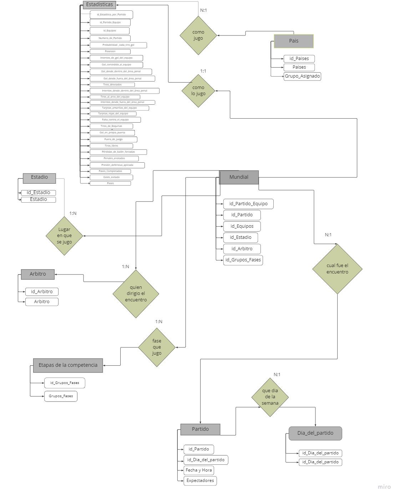

# ⚽ FIFA World Cup Qatar 2022 — Análisis de Datos
### Proyecto de Análisis | Excel · Power BI



---

## 📋 Descripción del Proyecto

Análisis completo de los **64 partidos** disputados en la Copa del Mundo FIFA Qatar 2022, desde la fase de grupos hasta la final del 18 de diciembre de 2022, en la que Argentina se consagró campeón del mundo.

El proyecto abarca el proceso completo de análisis de datos: desde la obtención y limpieza del dataset crudo hasta la visualización interactiva en Power BI, pasando por un proceso de normalización de datos en Excel que resultó en un modelo relacional de 8 tablas.

---

## 🎯 Hipótesis de Análisis

El proyecto busca responder tres preguntas principales:

**1. Rendimiento y estadísticas**
> ¿Los equipos que avanzaron más en el torneo fueron los que mejores estadísticas tuvieron (posesión, tiros, pases)?

**2. Comportamiento arbitral**
> ¿Los árbitros sacaron tarjetas amarillas en menos del 50% de las faltas cometidas, y tarjetas rojas en menos del 5%?

**3. Asistencia de espectadores**
> ¿La concurrencia de espectadores fue constante a lo largo del torneo o disminuyó a medida que avanzaba la competencia?

---

## 🗂️ Estructura del Repositorio

```
Proyecto-Qatar-Excel-SQL-PowerBI/
│
├── 📁 data/
│   └── qatar2022_dataset_original.csv      ← Dataset crudo (64 partidos, 59 columnas)
│
├── 📁 excel/
│   └── qatar2022_base_datos_normalizada.xlsx  ← Modelo relacional (8 tablas)
│
├── 📁 powerbi/
│   └── qatar2022_dashboard.pbix            ← Dashboard interactivo Power BI
│
├── 📁 assets/
│   └── qatar2022_dashboard_preview.jpg     ← Captura del dashboard
│
├── 📁 docs/
│   └── qatar2022_documentacion_completa.pdf  ← Documentación técnica del proyecto
│
└── README.md
```

---

## 🛠️ Herramientas Utilizadas

| Herramienta | Uso |
|---|---|
| **Microsoft Excel** | Limpieza, transformación y normalización del dataset |
| **Power BI Desktop** | Modelado de datos y visualización interactiva |
| **Miro** | Diseño del diagrama entidad-relación |

---

## 🔄 Proceso de Normalización

El dataset original contenía **64 filas × 59 columnas**, donde cada fila representaba un partido completo con las estadísticas de ambos equipos mezcladas. Esto impedía relacionar correctamente las estadísticas por equipo.

A través de un proceso de normalización se generaron **8 tablas** interrelacionadas:

| Tabla | Descripción | PK |
|---|---|---|
| **Mundial** | Tabla puente central que conecta todas las demás | id_Partido_Equipo |
| **Estadísticas** | Estadísticas de cada equipo por partido (128 filas) | id_Estadistica_por_Partido |
| **Partidos** | Fecha, hora y espectadores de cada partido | id_Partido |
| **País** | 32 países participantes y su grupo | id_Paises |
| **Estadio** | 8 estadios sede del torneo | id_Estadio |
| **Árbitro** | 29 árbitros del torneo | id_Arbitro |
| **Etapas de la Competencia** | Fase de grupos, octavos, cuartos, semis, final | id_Fase_Grupo |
| **Día del Partido** | Día de la semana de cada encuentro | id_Dia_del_partido |

La clave del modelo fue la tabla **Mundial**, que resolvió las relaciones muchos-a-muchos y permitió generar relaciones uno-a-muchos limpias en Power BI.

---

## 📊 Dashboard — Páginas y Visualizaciones

El dashboard en Power BI cuenta con 4 páginas:

**1. Presentación** — Portada del proyecto

**2. Estadios**
- Accionar arbitral: faltas vs tarjetas amarillas y rojas por árbitro
- Espectadores por día durante la competencia
- KPIs: Total tarjetas amarillas (220), tarjetas rojas (3), ~3 millones de espectadores

**3. Países**
- Mapa mundial con países participantes por grupo
- Posesión del balón por país
- Tarjetas por país
- Pases completados vs totales · Faltas sufridas · Fuera de juego

**4. Gol**
- Goles totales por fase de la competencia (172 en total)
- Goles contra el equipo vs goles evitados por país
- Intentos de gol dentro y fuera del área penal
- Tiros de esquina (572) · Tiros libres (1823)

**Segmentaciones disponibles:** País · Etapa de la competencia · Grupo

---

## 📐 Medidas DAX Calculadas

```dax
-- Total de tiros (al arco + desviados)
Tiros Totales = 
SUM('Estadisticas'[Tiros_al_arco_del_equipo]) + 
SUM('Estadisticas'[Tiros_desviados])

-- Goles acumulados por etapa
Total acumulado de Gol en Grupos_Fases = 
CALCULATE(
    SUM('Estadisticas'[Gol]),
    FILTER(
        ALLSELECTED('Etapas de la competencia'[Grupos_Fases]),
        ISONORAFTER('Etapas de la competencia'[Grupos_Fases], 
                    MAX('Etapas de la competencia'[Grupos_Fases]), DESC)
    )
)

-- Tarjetas amarillas totales
Total Tarjetas Amarillas = 
CALCULATE(
    SUM('Estadisticas'[Tarjetas_amarillas_del_equipo]),
    ALLSELECTED('Estadisticas'[Numero_de_Partido])
)

-- Tarjetas rojas totales
Total Tarjetas Rojas = 
CALCULATE(
    SUM('Estadisticas'[Tarjetas_rojas_del_equipo]),
    ALLSELECTED('Estadisticas'[Numero_de_Partido])
)
```

---

## ✅ Conclusiones

**Sobre el rendimiento:** Las mejores estadísticas generalmente acompañaron a los equipos que avanzaron más en el torneo, aunque no fue una regla absoluta. Argentina es el ejemplo más claro: no siempre tuvo las mejores estadísticas del partido, pero se consagró campeón — el factor táctico y mental fue determinante.

**Sobre el arbitraje:** La hipótesis se confirmó. Las tarjetas fueron considerablemente menores en proporción a las faltas sancionadas, con solo 3 tarjetas rojas en todo el torneo, muy por debajo del umbral del 5% propuesto.

**Sobre los espectadores:** La asistencia no fue completamente constante — se concentró mayormente en las primeras etapas del torneo — pero la variación no fue significativa, y el total rondó los 3 millones de espectadores.

---

## 👤 Autor

**Michael Hans Evans**  
Data Analyst | Buenos Aires, Argentina  
[](https://github.com/MHEvans02)
